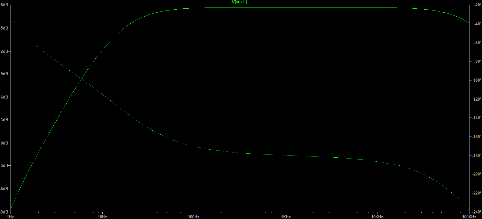

# Stereo Audio Pre-Amplifier with LED Level Indicator (KiCad)

## Overview

This project presents the design and implementation of a stereo analog audio pre-amplifier with an integrated LED level indicator. The system amplifies low-level audio signals and provides a visual representation of signal activity.

---

## System Architecture

Block diagram showing the structure of the system including input processing, control logic, and output stages.

---

## Simulation Results

Simulated frequency response of the amplifier, showing stable gain across the audio range and controlled filtering behavior.

---

## Circuit Design

Detailed circuit schematic including input stage, tone control, amplification stages, and LED signal detection.

---

## PCB Design

3D visualization of the PCB layout designed in KiCad, showing component placement and routing.

---

## Code Logic

Implementation of core signal or tracking logic, including coordinate correction and processing behavior.

---

## Features

* Stereo audio amplification
* Active bass and treble control
* LED-based signal level indication
* Single supply operation (12V)
* Full PCB design and layout
* Simulation-based validation

---

## Bill of Materials

Main components used in the project:

* Operational amplifiers: TL082, LM358
* Capacitors: 100nF, 47µF, 100µF, 1.5nF
* Resistors: various values including 10kΩ, 100kΩ, 330kΩ
* Diodes: 1N5819
* LEDs: red indicator LEDs
* Audio connectors: 3.5mm jack

Full BOM is available in the project documentation.

---

## Documentation

A detailed technical report is included in the repository:
PCB_Bericht final.pdf

This report covers theoretical background, simulation, design decisions, PCB layout, and validation results.

---

## Tools Used

* KiCad for schematic and PCB design
* LTspice for circuit simulation

---

## Author

Ayoub Khichi
Electrical Engineering Student
Hochschule Koblenz
